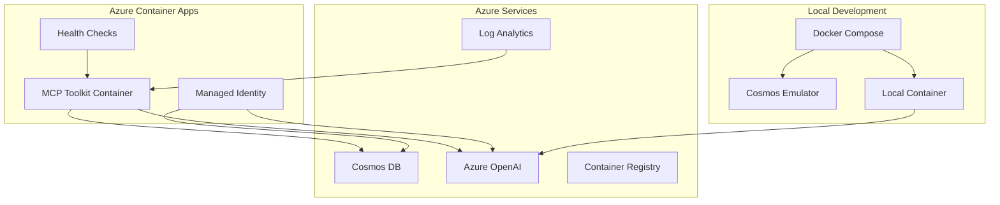

# Azure Cosmos DB MCP Toolkit

A Model Context Protocol (MCP) toolkit that provides seamless integration with Azure Cosmos DB and Azure OpenAI for document querying, vector search, and schema inspection through AI agents. **Now with full containerization support for Azure Container Apps!**

## Overview

This Azure Cosmos DB MCP Toolkit is a production-ready MCP Server that enables AI agents to interact with Azure Cosmos DB. It supports traditional document queries, full-text search, vector similarity search using Azure OpenAI embeddings, and schema discovery. All operations use Entra ID (Azure AD) authentication for secure, enterprise-grade access to Azure services.

**Key Features:**
- 🔍 Document querying and full-text search
- 🧠 AI-powered vector similarity search with Azure OpenAI embeddings
- 📊 Container schema discovery and analysis
- 🔐 Secure Entra ID authentication with Managed Identity support
- 🏷️ Model Context Protocol integration for AI agents
- ⚡ Real-time query execution with comprehensive error handling
- 🐳 **Full containerization support for Azure Container Apps**
- 🚀 **One-click deployment to Azure with automated CI/CD**
- � **Local development with Docker Compose and Cosmos DB emulator**

## 🚀 Quick Deploy to Azure

Get started instantly with a complete Azure infrastructure deployment that includes all necessary resources and RBAC configuration:

[](https://portal.azure.com/#create/Microsoft.Template/uri/https%3A%2F%2Fraw.githubusercontent.com%2FAzureCosmosDB%2FMCPToolKit%2Fmain%2Finfrastructure%2Fdeploy-all-resources.json)

[](https://github.com/AzureCosmosDB/MCPToolKit/actions/workflows/deploy-complete.yml)

> **⚠️ Important**: If your Azure subscription has policies requiring an "owner" tag, you'll need to provide an **Owner Tag** value during deployment. This is typically your email address or username.

**What gets deployed:**
- ✅ **Azure Cosmos DB** (serverless) with sample database and container
- ✅ **Azure OpenAI** service with text-embedding-ada-002 deployment
- ✅ **Azure Container Registry** for your container images
- ✅ **Azure Container Apps** environment with managed identity
- ✅ **Complete RBAC setup** with all necessary permissions
- ✅ **Log Analytics workspace** for monitoring and diagnostics

### Alternative Deployment Methods

#### PowerShell Quick Deploy (Recommended for Advanced Users)
```powershell
# Download and run the complete deployment script
Invoke-WebRequest -Uri "https://raw.githubusercontent.com/AzureCosmosDB/MCPToolKit/main/scripts/Deploy-Complete.ps1" -OutFile "Deploy-Complete.ps1"

# Run with your configuration
.\Deploy-Complete.ps1 `
    -ResourceGroupName "rg-mcp-toolkit" `
    -Location "East US" `
    -PrincipalId "your-user-object-id" `
    -PrincipalType "User"
```

#### Linux/Mac Quick Deploy
```bash
# Download and run the complete deployment script
curl -O https://raw.githubusercontent.com/AzureCosmosDB/MCPToolKit/main/scripts/deploy-complete.sh
chmod +x deploy-complete.sh

# Set environment variables and run
export RESOURCE_GROUP_NAME="rg-mcp-toolkit"
export LOCATION="East US"
export PRINCIPAL_ID="your-user-object-id"
export PRINCIPAL_TYPE="User"
./deploy-complete.sh
```

#### GitHub Actions Workflow Deploy
For automated deployment with full CI/CD integration:

1. **Fork this repository** to your GitHub account
2. **Set up repository secrets:**
   - `AZURE_CREDENTIALS` - Service principal JSON for Azure access
   - `AZURE_SUBSCRIPTION_ID` - Your Azure subscription ID

3. **Run the workflow:**
   - Go to Actions → "Deploy Complete Infrastructure to Azure"
   - Click "Run workflow"
   - Enter your deployment parameters
   - Monitor progress and get deployment summary

> **💡 Tip**: Get your user object ID by running: `az ad signed-in-user show --query id -o tsv`

## Deployment Options

### 🚀 Option 1: Azure Container Apps (Recommended for Production)

Deploy to Azure Container Apps with automated scaling, managed identity, and enterprise security.

#### Prerequisites
- Azure CLI installed
- Docker installed
- Azure subscription with appropriate permissions

#### Quick Deployment
```powershell
# Clone the repository
git clone <repository-url>
cd MCPToolKit

# Run the deployment script
.\scripts\deploy.ps1 `
    -ResourceGroupName "rg-mcp-toolkit" `
    -Location "East US" `
    -CosmosEndpoint "https://your-cosmosdb-account.documents.azure.com:443/" `
    -OpenAIEndpoint "https://your-openai-service.openai.azure.com/" `
    -OpenAIEmbeddingDeployment "text-embedding-ada-002"
```

This will:
- ✅ Create Azure Container Registry
- ✅ Build and push Docker image
- ✅ Deploy to Azure Container Apps with managed identity
- ✅ Configure health checks and auto-scaling
- ✅ Set up monitoring with Log Analytics

#### Manual Azure Deployment Steps

1. **Build and push the container image:**
```bash
# Login to Azure and create ACR
az login
az group create --name rg-mcp-toolkit --location eastus
az acr create --resource-group rg-mcp-toolkit --name mcptoolkitacr --sku Basic --admin-enabled true

# Build and push image
az acr login --name mcptoolkitacr
docker build -t mcptoolkitacr.azurecr.io/mcp-toolkit:latest .
docker push mcptoolkitacr.azurecr.io/mcp-toolkit:latest
```

2. **Deploy the infrastructure:**
```bash
az deployment group create \
    --resource-group rg-mcp-toolkit \
    --template-file infrastructure/main.bicep \
    --parameters \
        containerImage=mcptoolkitacr.azurecr.io/mcp-toolkit:latest \
        cosmosEndpoint="https://your-cosmosdb-account.documents.azure.com:443/" \
        openaiEndpoint="https://your-openai-service.openai.azure.com/" \
        openaiEmbeddingDeployment="text-embedding-ada-002"
```

3. **Configure RBAC permissions:** (see Security Setup section below)

### 🐳 Option 2: Local Development with Docker Compose

Perfect for development, testing, and local AI agent integration.

#### Prerequisites
- Docker and Docker Compose installed
- Azure OpenAI service (for vector search features)

#### Quick Start
```bash
# Clone the repository
git clone <repository-url>
cd MCPToolKit

# Set up environment variables
copy .env.example .env
# Edit .env with your Azure OpenAI credentials

# Start the local environment
docker-compose up -d

# The MCP server will be available at http://localhost:8080
# Cosmos DB emulator will be available at https://localhost:8081
```

This includes:
- ✅ Azure Cosmos DB Linux emulator
- ✅ MCP Toolkit container
- ✅ Automatic container networking
- ✅ Persistent data storage
- ✅ Health checks and restart policies

### Development Configuration

Create a `.env` file in the project root:
```env
# Azure OpenAI Configuration (required for vector search)
OPENAI_ENDPOINT=https://your-openai-service.openai.azure.com/
OPENAI_EMBEDDING_DEPLOYMENT=text-embedding-ada-002

# For local development with emulator, Cosmos endpoint is automatically configured
# COSMOS_ENDPOINT=https://cosmos-emulator:8081/
```

#### Cosmos DB Emulator Certificate Setup (For SSL)

The Cosmos DB emulator uses a self-signed certificate. For production-like testing:

**Windows (PowerShell)**:
```powershell
.\scripts\Setup-CosmosCert.ps1
```

**Linux/macOS (Bash)**:
```bash
./scripts/setup-cosmos-cert.sh
```

This downloads and installs the emulator's certificate for SSL connections.

### 📱 Option 3: Traditional Local Development

For developers who prefer running .NET directly.

```bash
# Set environment variables
export COSMOS_ENDPOINT="https://your-cosmosdb-account.documents.azure.com:443/"
export OPENAI_ENDPOINT="https://your-openai-service.openai.azure.com/"
export OPENAI_EMBEDDING_DEPLOYMENT="text-embedding-ada-002"

# Build and run
dotnet restore
dotnet build
dotnet run
```

## CI/CD Pipeline Setup

### GitHub Actions (Included)

The repository includes a complete GitHub Actions workflow for automated deployment:

1. **Set up repository secrets:**
   - `AZURE_CREDENTIALS` - Service principal for Azure access
   - `AZURE_SUBSCRIPTION_ID` - Your Azure subscription ID
   - `COSMOS_ENDPOINT` - Your Cosmos DB endpoint
   - `OPENAI_ENDPOINT` - Your Azure OpenAI endpoint  
   - `OPENAI_EMBEDDING_DEPLOYMENT` - Your embedding deployment name

2. **Trigger deployment:**
   - Push to `main` branch for automatic deployment
   - Use `workflow_dispatch` for manual deployment with environment selection

3. **Monitor deployment:**
   - View progress in GitHub Actions
   - Check deployment summary with direct links to Azure resources

## Container Configuration

### Environment Variables
| Variable | Description | Required | Default | Example |
|----------|-------------|----------|---------|---------|
| `COSMOS_ENDPOINT` | Azure Cosmos DB endpoint URL | Yes | - | `https://myaccount.documents.azure.com:443/` |
| `OPENAI_ENDPOINT` | Azure OpenAI service endpoint | Yes* | - | `https://myopenai.openai.azure.com/` |
| `OPENAI_EMBEDDING_DEPLOYMENT` | Azure OpenAI embedding deployment name | Yes* | - | `text-embedding-ada-002` |
| `ASPNETCORE_ENVIRONMENT` | ASP.NET Core environment | No | `Production` | `Development` |
| `ASPNETCORE_URLS` | Application listening URLs | No | `http://+:8080` | `http://+:8080` |

*Required only for vector search functionality

### Docker Compose Environment
The Docker Compose setup automatically configures:
- `COSMOS_ENDPOINT=https://cosmos-emulator:8081/`
- `COSMOS_EMULATOR_SSL_VERIFY=false` (for development)
- Network connectivity between containers
- Volume persistence for Cosmos emulator data

### Health Checks
The container includes health check endpoints:
- **Readiness**: `/health` - Container is ready to receive traffic
- **Liveness**: `/health` - Container is alive and responsive

### Resource Requirements
- **CPU**: 0.5 cores (minimum)
- **Memory**: 1 GB (minimum)
- **Storage**: Minimal (stateless application)

### Scaling Configuration
- **Min Replicas**: 1 (can scale to zero when idle)
- **Max Replicas**: 3 (configurable based on load)
- **Scale Trigger**: HTTP concurrent requests (10 per replica)

## Supported MCP Tools

The toolkit provides the following Model Context Protocol (MCP) tools for AI agents:

### Database & Container Management
- **`ListDatabases`** - Lists all databases available in the Cosmos DB account
- **`ListCollections`** - Lists containers (collections) for a specified database

### Document Querying
- **`GetRecentDocuments`** - Gets the most recent N documents ordered by timestamp (_ts DESC). N must be between 1-20
- **`FindDocumentByID`** - Finds a specific document by its ID in the specified database/container
- **`TextSearch`** - Performs full-text search on a specified property using FullTextContains. N must be between 1-20

### Schema Discovery
- **`GetApproximateSchema`** - Analyzes up to 10 sample documents to infer the container's schema, including property names, data types, and frequency of occurrence

### AI-Powered Vector Search
- **`VectorSearch`** - Performs semantic vector search using Azure OpenAI embeddings. Finds documents that are semantically similar to the input text. N must be between 1-50
  - Automatically generates embeddings for search text using Azure OpenAI
  - Returns results with similarity scores (_score field)
  - Supports custom property projection (explicit properties only)
  - No wildcard (`*`) selection allowed - must specify explicit properties
  - Uses `VectorDistance` function for similarity calculations

## Technical Specifications

### Platform Requirements
- **.NET 9.0** - Latest .NET runtime for optimal performance
- **Azure Cosmos DB** - NoSQL database with vector search capabilities
- **Azure OpenAI** - For embedding generation (text-embedding-ada-002 recommended)
- **Docker** - For containerization and local development

### Container Configuration
- **Base Image**: `mcr.microsoft.com/dotnet/aspnet:9.0`
- **Port**: 8080 (configured for Azure Container Apps compatibility)
- **Health Endpoint**: `/health` - Returns HTTP 200 when service is ready
- **Non-root User**: Runs as `appuser` (UID 1000) for security

### Authentication & Security
- **DefaultAzureCredential**: Automatic authentication across environments
  - **Local Development**: Uses `az login` credentials
  - **Azure Container Apps**: Uses managed identity
  - **CI/CD**: Supports service principal authentication
- **RBAC Permissions**: Least privilege access with specific role assignments
- **HTTPS Enforcement**: TLS 1.2+ for all Azure service connections

## Security Setup

### Azure Container Apps (Managed Identity)

When deployed to Azure Container Apps, the application uses a managed identity for secure authentication:

#### 1. Cosmos DB RBAC Configuration
```bash
# Get the managed identity principal ID from deployment output
PRINCIPAL_ID="<managed-identity-principal-id-from-deployment>"

# Assign Cosmos DB Data Contributor role
az cosmosdb sql role assignment create \
  --account-name your-cosmosdb-account \
  --resource-group your-cosmosdb-resource-group \
  --scope "/" \
  --principal-id $PRINCIPAL_ID \
  --role-definition-id 00000000-0000-0000-0000-000000000002
```

#### 2. Azure OpenAI RBAC Configuration
```bash
# Assign Cognitive Services OpenAI User role
az role assignment create \
  --assignee $PRINCIPAL_ID \
  --role "Cognitive Services OpenAI User" \
  --scope /subscriptions/your-subscription-id/resourceGroups/your-openai-rg/providers/Microsoft.CognitiveServices/accounts/your-openai-service
```

### Local Development Setup

For local development (including Docker Compose), you'll need to authenticate using your user account:

#### 1. Azure CLI Login
```bash
az login
```

#### 2. Configure Cosmos DB RBAC for Your User
```bash
# Get your user object ID
USER_ID=$(az ad signed-in-user show --query id -o tsv)

# Assign Cosmos DB Built-in Data Contributor role
az cosmosdb sql role assignment create \
  --account-name your-cosmosdb-account \
  --resource-group your-resource-group \
  --scope "/" \
  --principal-id $USER_ID \
  --role-definition-id 00000000-0000-0000-0000-000000000002
```

#### 3. Configure Azure OpenAI RBAC for Your User
```bash
# Assign Cognitive Services OpenAI User role
az role assignment create \
  --assignee $USER_ID \
  --role "Cognitive Services OpenAI User" \
  --scope /subscriptions/your-subscription-id/resourceGroups/your-resource-group/providers/Microsoft.CognitiveServices/accounts/your-openai-service
```

## Security Considerations

⚠️ **IMPORTANT SECURITY NOTICE**

This MCP Toolkit uses Entra ID (Azure AD) and Managed Identities to connect securely to Azure Cosmos DB and Azure OpenAI resources. However, it's critical to understand the security implications:

### Data Access and Exposure
- **Any data accessible to this MCP server can potentially be exposed to connected AI agents or applications**
- The MCP server can execute tools that may read/edit/add any document in the databases and containers it has access to
- Connected agents may request and receive data through the available tools

### Container Security Features
- ✅ **Non-root user**: Containers run as non-privileged user (uid 1000)
- ✅ **Managed Identity**: No credentials stored in container images or environment variables
- ✅ **HTTPS-only ingress**: All external traffic uses TLS encryption
- ✅ **Health checks**: Automatic restart of unhealthy containers
- ✅ **Resource limits**: CPU and memory constraints prevent resource exhaustion

### Access Control Requirements
- **Grant RBAC permissions ONLY to specific databases and containers** that you want AI agents to access
- Use the principle of least privilege - don't grant broad access to your entire Cosmos DB account
- Regularly review and audit the permissions granted to the MCP server's identity
- Consider creating dedicated databases/containers for AI agent access rather than sharing production data

### Network Security
- Container Apps ingress is HTTPS-only with automatic TLS termination
- Internal container communication uses encrypted channels
- Log Analytics workspace captures security events and access patterns

**Recommendation**: Start with a dedicated, isolated Cosmos DB account containing only non-sensitive test data when first deploying this toolkit.

## VS Code Integration

### Container-based Development
When using Docker Compose for local development:

1. **Start the containerized environment:**
```bash
docker-compose up -d
```

2. **Configure VS Code MCP integration:**
Create or update `.vscode/mcp.json`:
```json
{
  "servers": {
    "azure-cosmos-db-mcp": {
      "type": "http",
      "url": "http://localhost:8080"
    }
  }
}
```

3. **Restart VS Code** and test with GitHub Copilot Chat

### Azure Container Apps Integration
For testing against your deployed Azure Container Apps instance:

```json
{
  "servers": {
    "azure-cosmos-db-mcp": {
      "type": "http",
      "url": "https://your-container-app-url.azurecontainerapps.io"
    }
  }
}
```

### Traditional Local Development
For running .NET directly (port 8080 is now default):

```json
{
  "servers": {
    "azure-cosmos-db-mcp": {
      "type": "http",
      "url": "http://localhost:8080"
    }
  }
}
```

### Basic Document Queries
```
@copilot List databases in my Cosmos DB account

@copilot Show containers in the 'ecommerce' database

@copilot Get the last 10 documents from the 'orders' container in 'ecommerce' database

@copilot Find document with ID '12345' in the 'products' container
```

### Schema Discovery
```
@copilot What's the schema of the 'customers' container in 'ecommerce' database?

@copilot Analyze the structure of documents in the 'inventory' container
```

### Text Search
```
@copilot Search for documents containing 'electronics' in the 'description' property of 'products' container

@copilot Find orders where the 'status' contains 'shipped' in the last 15 results
```

### Vector Search (Semantic Search)
```
@copilot Find products similar to 'wireless headphones' and return id, name, price from the 'products' container using the 'contentVector' property

@copilot Search for documents semantically similar to 'customer service complaint' in the 'feedback' container, return id, subject, content using vector property 'embeddings'
```

## Testing & Development

### 📋 Comprehensive Testing Resources

This repository includes detailed testing guides:

- **[TESTING_GUIDE.md](TESTING_GUIDE.md)** - Complete testing scenarios for local and Azure environments
- **[docs/deploy-to-azure-guide.md](docs/deploy-to-azure-guide.md)** - Detailed deployment documentation

### 🧪 Unit Tests

Run the included unit tests:
```bash
# Run all tests
dotnet test

# Run tests with verbose output
dotnet test --verbosity normal

# Run specific test class
dotnet test --filter CosmosDbToolsTests
```

### 🔍 Health Monitoring

The application includes a health check endpoint for monitoring:

```bash
# Local development
curl http://localhost:8080/health

# Azure deployment
curl https://your-container-app.azurecontainerapps.io/health
```

Returns HTTP 200 with "Healthy" when the service is ready to accept requests.

## Key Dependencies

### .NET Packages
- **ModelContextProtocol.AspNetCore** (v0.3.0-preview.4) - MCP server framework
- **Microsoft.Azure.Cosmos** (v3.53.0) - Cosmos DB .NET SDK
- **Azure.Identity** (v1.12.0) - Authentication library with DefaultAzureCredential
- **Azure.AI.OpenAI** (v2.0.0) - Azure OpenAI client for embeddings
- **ASP.NET Core 9.0** - Web framework and hosting

### Development Dependencies
- **xUnit** (v2.6.1) - Unit testing framework
- **FluentAssertions** (v6.12.0) - Assertion library for tests
- **Moq** (v4.20.69) - Mocking framework
- **Microsoft.AspNetCore.Mvc.Testing** - Integration testing

## Vector Search Setup

For vector search functionality, your Cosmos DB documents need to contain vector embeddings. Here's an example document structure:

```json
{
  "id": "product-123",
  "name": "Wireless Bluetooth Headphones",
  "description": "High-quality wireless headphones with noise cancellation",
  "category": "Electronics",
  "price": 199.99,
  "contentVector": [0.1, 0.2, 0.3, ...], // 1536-dimensional embedding array
  "_ts": 1234567890
}
```

The `contentVector` field contains the embedding generated by an Azure OpenAI's embedding model for the product's text content.

## Troubleshooting

## Troubleshooting

### Container Deployment Issues

#### Health Check Failures
```bash
# Test health endpoint directly
curl http://localhost:8080/health  # Local
curl https://your-app.azurecontainerapps.io/health  # Azure

# Expected response: HTTP 200 "Healthy"
```

#### Authentication Errors
The application uses **DefaultAzureCredential** which attempts authentication in this order:
1. **Environment variables** (service principal)
2. **Managed identity** (in Azure)
3. **Azure CLI** (`az login`)
4. **Visual Studio/VS Code** credentials

**Solutions**:
- For local development: Run `az login`
- For Azure: Ensure managed identity has proper RBAC assignments
- For CI/CD: Set `AZURE_CLIENT_ID`, `AZURE_CLIENT_SECRET`, `AZURE_TENANT_ID`

#### Azure Container Apps Deployment Failures
```bash
# Check deployment status
az deployment group list --resource-group rg-mcp-toolkit --output table

# View deployment details
az deployment group show --resource-group rg-mcp-toolkit --name <deployment-name>

# Check container app logs
az containerapp logs show --name mcp-toolkit --resource-group rg-mcp-toolkit
```

#### Docker Compose Issues
```bash
# Check container status
docker-compose ps

# View logs
docker-compose logs mcp-toolkit
docker-compose logs cosmos-emulator

# Restart services
docker-compose restart

# Rebuild and restart
docker-compose up --build
```

#### Container Health Check Failures
```bash
# Test health endpoint directly
curl http://localhost:8080/health

# For Azure Container Apps
curl https://your-app.azurecontainerapps.io/health
```

### Common Issues

#### Authentication Errors
- **Error**: `Unauthorized` or `Forbidden`
- **Container Solution**: Check managed identity configuration and RBAC assignments
- **Local Solution**: Verify `az login` and user permissions

#### Environment Variables
- **Error**: `Missing required environment variable`
- **Container Solution**: Verify Bicep template parameters and deployment configuration
- **Local Solution**: Check `.env` file and docker-compose environment variables

#### Port Conflicts
- **Error**: Port 8080 already in use
- **Solution**: Stop conflicting services or change port mapping in docker-compose.yml

#### Cosmos DB Emulator Issues (Local Development)
```bash
# Reset emulator data
docker-compose down
docker volume rm mcp-toolkit-cosmos-data
docker-compose up -d

# Import emulator SSL certificate (Windows)
curl -k https://localhost:8081/_explorer/emulator.pem > cosmos-emulator.crt
certlm.msc # Import the certificate to Trusted Root Certification Authorities
```

#### Vector Search Issues
- **Error**: Vector search returning no results
- **Solution**: Ensure documents have vector embeddings and the vectorProperty parameter matches your schema

#### Network Connectivity (Containers)
```bash
# Test container-to-container communication
docker-compose exec mcp-toolkit ping cosmos-emulator

# Check network configuration
docker network ls
docker network inspect mcp-toolkit-network
```

### Debug Mode

#### Container Debugging
```bash
# Run with debug logging
docker-compose -f docker-compose.yml -f docker-compose.override.yml up

# Access container shell
docker-compose exec mcp-toolkit /bin/bash

# Check environment variables inside container
docker-compose exec mcp-toolkit env | grep -E "(COSMOS|OPENAI)"
```

#### Azure Container Apps Debugging
```bash
# Enable debug logging
az containerapp update \
  --name mcp-toolkit \
  --resource-group rg-mcp-toolkit \
  --set-env-vars ASPNETCORE_LOGGING__LOGLEVEL__DEFAULT=Debug

# Stream logs
az containerapp logs tail --name mcp-toolkit --resource-group rg-mcp-toolkit
```

### Verify Configuration

#### Container Environment
```bash
# Check all environment variables
docker-compose config

# Test container image locally
docker run --rm -it mcptoolkitacr.azurecr.io/mcp-toolkit:latest /bin/bash
```

#### Azure Resources
```bash
# Verify Cosmos DB access
az cosmosdb show --name your-cosmos-account --resource-group your-rg

# Verify OpenAI access  
az cognitiveservices account show --name your-openai --resource-group your-rg

# Check RBAC assignments
az role assignment list --assignee <principal-id> --scope <resource-scope>
```

## Monitoring and Observability

### Azure Container Apps Monitoring
- **Application Insights**: Automatic telemetry collection
- **Log Analytics**: Centralized logging and querying
- **Health Checks**: Built-in readiness and liveness probes
- **Metrics**: CPU, memory, and request metrics

### Monitoring Queries (Log Analytics)
```kusto
// Application logs
ContainerAppConsoleLogs_CL
| where ContainerAppName_s == "mcp-toolkit"
| order by TimeGenerated desc

// Health check failures
ContainerAppConsoleLogs_CL
| where ContainerAppName_s == "mcp-toolkit"
| where Log_s contains "health"
| where Log_s contains "fail"
```

## Performance and Scaling

### Azure Container Apps Scaling
- **Horizontal scaling**: 1-3 replicas based on HTTP requests
- **Scale trigger**: 10 concurrent requests per replica
- **Scale-to-zero**: Automatically scales down during idle periods
- **Custom scaling**: Modify `infrastructure/main.bicep` for different scaling rules

### Resource Optimization
```bash
# Update container resources
az containerapp update \
  --name mcp-toolkit \
  --resource-group rg-mcp-toolkit \
  --cpu 1.0 \
  --memory 2.0Gi
```

## Contributing

### Development Workflow
1. **Fork and clone** the repository
2. **Create feature branch** from `dev/sajee/updates`
3. **Test locally** using Docker Compose
4. **Deploy to test environment** using GitHub Actions
5. **Submit pull request** with comprehensive testing

### Container Development
```bash
# Build and test locally
docker build -t mcp-toolkit-dev .
docker run -p 8080:8080 --env-file .env mcp-toolkit-dev

# Run tests
docker-compose -f docker-compose.yml -f docker-compose.test.yml up --abort-on-container-exit
```

## Support and Documentation

### Quick Links
- **Health Check**: `GET /health` - Container health status
- **Azure Portal**: Monitor your deployed resources
- **GitHub Actions**: View deployment history and logs
- **Log Analytics**: Query application logs and metrics

### Getting Help
1. **Container Issues**: Check the troubleshooting section above
2. **Azure Resources**: Review Azure Cosmos DB and Container Apps documentation  
3. **GitHub Issues**: Open an issue with deployment logs and configuration details
4. **Security Questions**: Follow the security considerations and RBAC setup guides

### Documentation Resources
- [Azure Container Apps Documentation](https://docs.microsoft.com/en-us/azure/container-apps/)
- [Azure Cosmos DB Documentation](https://docs.microsoft.com/en-us/azure/cosmos-db/)
- [Azure OpenAI Documentation](https://docs.microsoft.com/en-us/azure/cognitive-services/openai/)
- [Model Context Protocol Specification](https://spec.modelcontextprotocol.io/)

## 🎯 Project Structure

```
MCPToolKit/
├── src/AzureCosmosDB.MCP.Toolkit/     # Main MCP server application (.NET 9.0)
│   ├── Program.cs                      # 7 MCP tools and web server setup
│   ├── *.csproj                       # Project configuration with latest packages
│   └── appsettings*.json              # Application configuration
├── tests/                             # Unit and integration tests (xUnit)
│   └── AzureCosmosDB.MCP.Toolkit.Tests/
├── infrastructure/                    # Bicep templates for Azure deployment
│   ├── deploy-all-resources.bicep     # Complete infrastructure template
│   └── *.json                        # ARM template versions for portal deployment
├── scripts/                          # Deployment and utility scripts (5 essential)
│   ├── Deploy-Complete.ps1           # Windows complete deployment
│   ├── deploy-complete.sh            # Linux/macOS complete deployment
│   ├── validate-setup.ps1            # Environment validation
│   └── Setup-CosmosCert.ps1          # Certificate setup for emulator
├── .github/workflows/                # GitHub Actions CI/CD pipelines
├── docs/                             # Additional documentation and guides
├── Dockerfile                        # Multi-stage container build (.NET 9.0)
├── docker-compose.yml               # Local dev environment + Cosmos emulator
├── TESTING_GUIDE.md                 # Comprehensive testing instructions
└── README.md                        # This comprehensive documentation
```

## 🚀 Quick Start Summary

1. **One-Click Azure Deployment**: [](https://portal.azure.com/#create/Microsoft.Template/uri/https%3A%2F%2Fraw.githubusercontent.com%2FAzureCosmosDB%2FMCPToolKit%2Fmain%2Finfrastructure%2Fdeploy-all-resources.json)
2. **Local Development**: `docker-compose up -d`
3. **VS Code Integration**: Configure `.vscode/mcp.json` with server URL
4. **Test with AI Agent**: "@copilot List databases in my Cosmos DB account"

---

## 📦 Container Architecture Summary



This containerized MCP Toolkit provides enterprise-ready deployment options with comprehensive monitoring, security, and scaling capabilities. Choose the deployment method that best fits your development workflow and production requirements.
