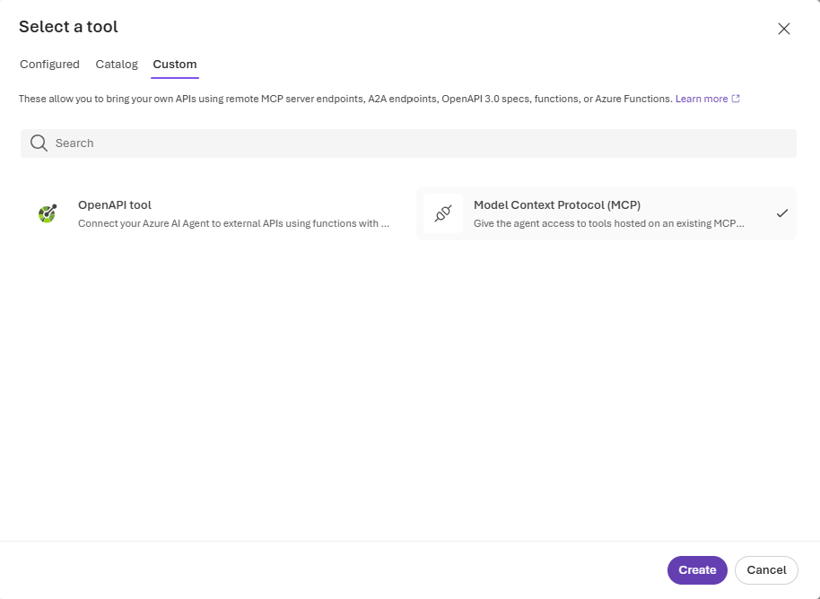
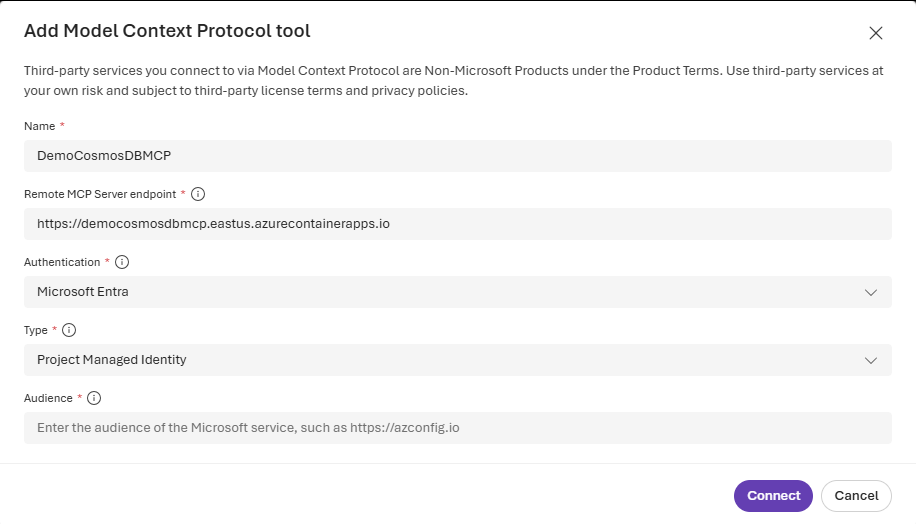
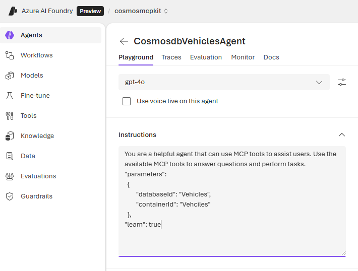

# Azure Cosmos DB MCP Toolkit

A Model Context Protocol (MCP) server that enables AI agents to interact with Azure Cosmos DB through natural language queries. Features enterprise-grade security with Azure Entra ID authentication, document operations, vector search, and schema discovery.

## Prerequisites

- Azure subscription ([Free account](https://azure.microsoft.com/free/))
- Azure CLI ([Install](https://docs.microsoft.com/cli/azure/install-azure-cli)) installed and authenticated
- PowerShell 7+ ([Install](https://docs.microsoft.com/powershell/scripting/install/installing-powershell)) (for deployment scripts)
- Docker Desktop ([Install](https://www.docker.com/products/docker-desktop/)) (for local development)
- .NET 9.0 SDK ([Install](https://dotnet.microsoft.com/download/dotnet/9.0)) (for local development)
- Git ([Install](https://git-scm.com/downloads))
- Azure Developer CLI ([Install](https://aka.ms/azure-dev/install)) (optional, only for `azd up` deployment method)

## What You Get

This toolkit provides:

- **Secure MCP Server**: JWT-authenticated endpoint for AI agents
- **Azure Cosmos DB Integration**: Full CRUD operations, vector search, and schema discovery
- **AI Foundry Ready**: Optional one-step integration with Azure AI Foundry projects
- **Enterprise Security**: Azure Entra ID, Managed Identity, RBAC
- **Production Ready**: Container Apps hosting with auto-scaling
- **Local Development**: Docker Compose and .NET dev options

### MCP Tools Available

| Tool | Description |
|------|-------------|
| `list_databases` | List all databases in the Cosmos DB account |
| `list_collections` | List all containers in a database |
| `get_approximate_schema` | Sample documents to infer schema (top-level properties) |
| `get_recent_documents` | Get N most recent documents ordered by timestamp |
| `find_document_by_id` | Find a document by its id |
| `text_search` | Search for documents where a property contains a search phrase |
| `vector_search` | Perform vector search using Azure OpenAI embeddings |

## Project Structure

```
MCPToolKit/
├── src/AzureCosmosDB.MCP.Toolkit/    # Main .NET 9.0 MCP server
│   ├── Controllers/                   # MCP Protocol & Health endpoints
│   ├── Services/                      # Cosmos DB & Auth services
│   └── wwwroot/                       # Test UI
├── infrastructure/                    # Bicep templates
│   ├── deploy-all-resources.bicep    # Main infrastructure
│   └── modules/                       # Entra App & role assignments
├── scripts/                           # Deployment automation
│   ├── Deploy-Cosmos-MCP-Toolkit.ps1 # One-step deployment (recommended)
│   └── Setup-AIFoundry-Connection.ps1
├── client/                            # Python AI Foundry client example
└── docs/                              # Additional documentation
```

## Quick Start

> **IMPORTANT**: For best results, ensure all resources (Azure Cosmos DB, AI Foundry Project, Container App) are created in the **same resource group**. This simplifies permissions, networking, and role assignments.


### Step 1: Deploy Infrastructure

Choose **ONE** of the following methods to deploy the infrastructure:

#### Option A: Deploy to Azure Button

Click the Deploy to Azure button to create all required Azure resources:

[](https://portal.azure.com/#create/Microsoft.Template/uri/https%3A%2F%2Fraw.githubusercontent.com%2FAzureCosmosDB%2FMCPToolKit%2Fmain%2Finfrastructure%2Fdeploy-all-resources.json)

**What gets deployed:**
- Azure Container Apps environment
- Azure Container Registry
- Managed Identity with RBAC assignments
- All networking and security configurations

**After deploying**, continue to **Step 2** to deploy the application.

---

#### Option B: Deploy via Azure Developer CLI (azd up)

> **Note**: Azure Developer CLI (`azd`) must be installed. If not installed, use [Option A](#option-a-deploy-to-azure-button) or install `azd`:
> - **Windows**: `winget install microsoft.azd`
> - **macOS/Linux**: `curl -fsSL https://aka.ms/install-azd.sh | bash`
> - Or download from: https://aka.ms/azure-dev/install

Deploy the complete infrastructure with a single command:

```bash
# Clone the repository
git clone https://github.com/AzureCosmosDB/MCPToolKit.git
cd MCPToolKit

# Initialize the azd project (first time only)
azd init

# Set the environment variables to match the Cosmos DB you want to access
azd env set COSMOS_ENDPOINT "https://<your-cosmos-account>.documents.azure.com:443/"

# Set the environment variables to match the AI Foundry resource you want to use
azd env set AIF_PROJECT_ENDPOINT "https://<aifoundry-project-name>.<region>.api.azureml.ms/"
azd env set EMBEDDING_DEPLOYMENT_NAME "text-embedding-ada-002"

# Optional: Set AI Foundry project resource ID for automatic RBAC setup
azd env set AIF_PROJECT_RESOURCE_ID "/subscriptions/<subscription-id>/resourceGroups/<aifoundry-resource-group>/providers/Microsoft.MachineLearningServices/workspaces/<aifoundry-project-name>"

# Then deploy
azd up
```

**What gets deployed:**
- Azure Container Apps environment
- Azure Container Registry
- Managed Identity with RBAC assignments
- All networking and security configurations

**After deploying**, continue to **Step 2** to deploy the application.

---

### Step 2: Deploy MCP Server Application (Required for Both Options)

> **Note:** This step is required regardless of which deployment method you chose in Step 1.

Run the one-step deployment script:

```powershell
.\scripts\Deploy-Cosmos-MCP-Toolkit.ps1 -ResourceGroup "YOUR-RESOURCE-GROUP"
```

This script:
- Builds and deploys the MCP server Docker image
- Creates Entra ID app registration for authentication
- Configures all security and permissions
- Outputs configuration to `deployment-info.json`

### Step 3: Test Your Deployment

Open the test UI: `https://YOUR-CONTAINER-APP.azurecontainerapps.io`

Or call the health endpoint:

```bash
curl https://YOUR-CONTAINER-APP.azurecontainerapps.io/health
```

All connection details are saved in `deployment-info.json` for reference.

## AI Foundry Integration  

To connect your MCP server to an Azure AI Foundry project:

**Option 1: Using Resource ID**

```powershell
.\scripts\Setup-AIFoundry-Connection.ps1 `
  -AIFoundryProjectResourceId "/subscriptions/xxx/resourceGroups/my-rg/providers/Microsoft.CognitiveServices/accounts/my-hub/projects/my-project" `
  -ConnectionName "cosmos-mcp-connection"
```

**Option 2: Using Project Name**

```powershell
.\scripts\Setup-AIFoundry-Connection.ps1 `
  -AIFoundryProjectName "YOUR-PROJECT-NAME" `
  -ResourceGroup "YOUR-RESOURCE-GROUP"
```

This assigns the necessary roles for AI Foundry to call your MCP server.

### Use Azure Cosmos DB MCP in AI Foundry

**Via Azure AI Foundry UI:**

1. Navigate to your Azure AI Foundry project
2. Go to **Build** → **Create agent**  
3. Select the **+ Add** in the tools section
4. Select the **Catalog** tab 
5. Choose **Azure Cosmos DB** as the tool and click **Create**

   

6. Select **Microsoft Entra** → **Project Managed Identity** as the authentication method
7. Enter your `<entra-app-client-id>` as the audience. This is the value from the deployment output.

   
   > [!TIP]
   > Find the `ENTRA_APP_CLIENT_ID` value in your `deployment-info.json` file or run:
   > ```powershell
   > Get-Content deployment-info.json | ConvertFrom-Json | Select-Object -ExpandProperty entraAppClientId
   > ```

8. Add instructions to your agent:

   

    ```
    You are a helpful agent that can use MCP tools to assist users. Use the available MCP tools to answer questions and perform tasks.
    "parameters":      
      {
            "databaseId": "<DATABASE_NAME>",
            "containerId": "<CONTAINER_NAME>"
      },
    "learn": true
    ```

9. Test MCP server in AI Foundry Playground using natural language queries:
    ```
    List all databases in my Cosmos DB account
    ```

    ```
    Show me the latest 10 documents from the products container
    ```

    ```
    What's the schema of the customers container?
    ```

    ```
    Search for documents where the name contains "Azure"
    ```

> **Note**: The MCP server provides secure access to Azure Cosmos DB data through conversational AI interfaces.

**Python Test Client:**

See the [Python Client README](client/README.md) for a complete example of using the MCP server with Azure AI Foundry agents.

## Configuration

### VS Code Configuration

To use with GitHub Copilot or other VS Code MCP clients:

1. Get your MCP server URL from `deployment-info.json`
2. Add to VS Code settings:

```json
{
  "mcp.servers": {
    "cosmosdb": {
      "url": "https://YOUR-CONTAINER-APP.azurecontainerapps.io/mcp",
      "headers": {
        "Authorization": "Bearer YOUR-JWT-TOKEN"
      }
    }
  }
}
```

## Security

### Authentication

- **JWT Bearer Tokens**: All requests require valid Microsoft Entra ID tokens
- **Audience Validation**: Tokens must be issued for your Entra App
- **Managed Identity**: Container App uses managed identity for Cosmos DB access
- **RBAC**: Least-privilege role assignments

### Local Development

For local development, set `DEV_BYPASS_AUTH=true` to bypass authentication. See [LOCAL_DEVELOPMENT.md](LOCAL_DEVELOPMENT.md) for details.

## Additional Resources

- [Architecture Diagrams](docs/ARCHITECTURE-DIAGRAMS.md) - System architecture, component interactions, and deployment topology diagrams
- [Web Testing Guide](docs/WEB-TESTING-GUIDE.md) - Using the browser-based test UI to interact with the MCP server
- [Local Development Guide](LOCAL_DEVELOPMENT.md) - Setup, testing, and debugging locally
- [Testing Guide](TESTING_GUIDE.md) - Unit and integration tests

## License

This project is licensed under the MIT License - see the [LICENSE](LICENSE) file for details.

## Contributing

Contributions are welcome! Please feel free to submit a Pull Request.

1. Fork the repository
2. Create your feature branch: `git checkout -b feature/amazing-feature`
3. Commit your changes: `git commit -m 'Add amazing feature'`
4. Push to the branch: `git push origin feature/amazing-feature`
5. Open a Pull Request
