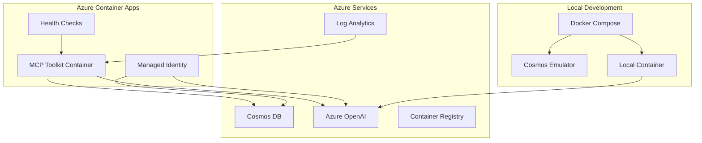

# Azure Cosmos DB MCP Toolkit

A Model Context Protocol (MCP) server that enables AI agents to interact with Azure Cosmos DB through natural language queries. Supports document operations, vector search, and schema discovery with enterprise-grade security.

## Features

- 🔍 **Document Operations** - Query documents, full-text search, schema discovery
- 🧠 **AI-Powered Vector Search** - Semantic search using Azure OpenAI embeddings
- 🔐 **Enterprise Security** - Azure managed identity and RBAC authentication
- 🐳 **Production Ready** - Containerized deployment to Azure Container Apps
- 🚀 **Easy Deployment** - One-click Azure deployment with complete infrastructure
- ⚡ **VS Code Integration** - Works seamlessly with GitHub Copilot Chat

## Quick Start

### Deploy to Azure (Recommended)

[](https://portal.azure.com/#create/Microsoft.Template/uri/https%3A%2F%2Fraw.githubusercontent.com%2FAzureCosmosDB%2FMCPToolKit%2Fmain%2Finfrastructure%2Fdeploy-all-resources.json)

**What gets deployed:** Cosmos DB, Azure OpenAI, Container Registry, Container Apps with full RBAC setup.

> **Note**: If your subscription requires "owner" tags, provide your email/username during deployment.

#### Script Deployment
```powershell
# PowerShell
Invoke-WebRequest -Uri "https://raw.githubusercontent.com/AzureCosmosDB/MCPToolKit/main/scripts/Deploy-Complete.ps1" -OutFile "Deploy-Complete.ps1"
.\Deploy-Complete.ps1 -ResourceGroupName "rg-mcp-toolkit" -Location "East US" -PrincipalId "your-user-object-id" -PrincipalType "User"
```

```bash
# Linux/Mac
curl -O https://raw.githubusercontent.com/AzureCosmosDB/MCPToolKit/main/scripts/deploy-complete.sh
chmod +x deploy-complete.sh
export RESOURCE_GROUP_NAME="rg-mcp-toolkit" && export LOCATION="East US" && ./deploy-complete.sh
```

### Local Development

```bash
git clone <repository-url>
cd MCPToolKit
docker-compose up -d
```

**Includes:** Cosmos DB emulator + MCP server on `http://localhost:8080`

## VS Code Integration

Create `.vscode/mcp.json`:
```json
{
  "servers": {
    "azure-cosmos-db-mcp": {
      "type": "http",
      "url": "http://localhost:8080"  // or your Azure Container Apps URL
    }
  }
}
```

### Example Queries

#### Basic Document Queries
```
@copilot List all databases in my Cosmos DB account
@copilot Show containers in the 'ecommerce' database
@copilot Get the last 10 documents from the 'orders' container in 'ecommerce' database
@copilot Find document with ID '12345' in the 'products' container
```

#### Schema Discovery
```
@copilot What's the schema of the 'customers' container in 'ecommerce' database?
@copilot Analyze the structure of documents in the 'inventory' container
```

#### Text Search
```
@copilot Search for documents containing 'electronics' in the 'description' property of 'products' container
@copilot Find orders where the 'status' contains 'shipped' in the last 15 results
```

#### Vector Search (Semantic Search)
```
@copilot Find products similar to 'wireless headphones' and return id, name, price from the 'products' container using the 'contentVector' property
@copilot Search for documents semantically similar to 'customer service complaint' in the 'feedback' container, return id, subject, content using vector property 'embeddings'
```

## MCP Tools

| Tool | Description | Parameters |
|------|-------------|------------|
| **ListDatabases** | Lists all databases | None |
| **ListCollections** | Lists containers in database | `databaseId` |
| **GetRecentDocuments** | Gets recent documents (1-20) | `databaseId`, `containerId`, `n` |
| **FindDocumentByID** | Finds document by ID | `databaseId`, `containerId`, `id` |
| **TextSearch** | Full-text search on properties | `databaseId`, `containerId`, `property`, `searchPhrase`, `n` |
| **VectorSearch** | Semantic search with AI embeddings | `databaseId`, `containerId`, `searchText`, `vectorProperty`, `selectProperties`, `topN` |
| **GetApproximateSchema** | Analyzes document structure | `databaseId`, `containerId` |

## Configuration

### Environment Variables
| Variable | Required | Description | Example |
|----------|----------|-------------|---------|
| `COSMOS_ENDPOINT` | Yes | Cosmos DB endpoint | `https://myaccount.documents.azure.com:443/` |
| `OPENAI_ENDPOINT` | Yes* | Azure OpenAI endpoint | `https://myopenai.openai.azure.com/` |
| `OPENAI_EMBEDDING_DEPLOYMENT` | Yes* | Embedding model deployment | `text-embedding-ada-002` |

*Required for vector search functionality

### Docker Compose (.env file)
```env
OPENAI_ENDPOINT=https://your-openai-service.openai.azure.com/
OPENAI_EMBEDDING_DEPLOYMENT=text-embedding-ada-002
# COSMOS_ENDPOINT is auto-configured for emulator
```

## Authentication & Security

### Azure Deployment
Uses managed identity with these RBAC roles:
- **Cosmos DB Built-in Data Contributor** (`00000000-0000-0000-0000-000000000002`)
- **Cognitive Services OpenAI User**

### Local Development
```bash
# Login with Azure CLI
az login

# Get your user ID
USER_ID=$(az ad signed-in-user show --query id -o tsv)

# Assign Cosmos DB permissions
az cosmosdb sql role assignment create \
  --account-name your-cosmosdb-account \
  --resource-group your-resource-group \
  --scope "/" \
  --principal-id $USER_ID \
  --role-definition-id 00000000-0000-0000-0000-000000000002

# Assign OpenAI permissions
az role assignment create \
  --assignee $USER_ID \
  --role "Cognitive Services OpenAI User" \
  --scope /subscriptions/your-subscription/resourceGroups/your-rg/providers/Microsoft.CognitiveServices/accounts/your-openai
```

## Advanced Deployment

### Manual Azure Deployment
```bash
# Build and push container
az acr create --resource-group rg-mcp-toolkit --name mcptoolkitacr --sku Basic
az acr login --name mcptoolkitacr
docker build -t mcptoolkitacr.azurecr.io/mcp-toolkit:latest .
docker push mcptoolkitacr.azurecr.io/mcp-toolkit:latest

# Deploy infrastructure
az deployment group create \
  --resource-group rg-mcp-toolkit \
  --template-file infrastructure/main.bicep \
  --parameters containerImage=mcptoolkitacr.azurecr.io/mcp-toolkit:latest
```

### GitHub Actions CI/CD
Set repository secrets:
- `AZURE_CREDENTIALS` - Service principal JSON
- `AZURE_SUBSCRIPTION_ID` - Your subscription ID

Trigger: Push to `main` or manual workflow dispatch.

## Vector Search Setup

Documents need vector embeddings for semantic search:
```json
{
  "id": "product-123",
  "name": "Wireless Bluetooth Headphones",
  "description": "High-quality wireless headphones",
  "contentVector": [0.1, 0.2, 0.3, ...], // 1536-dimensional array
  "_ts": 1234567890
}
```

## Troubleshooting

### Health Check
```bash
curl http://localhost:8080/health  # Local
curl https://your-app.azurecontainerapps.io/health  # Azure
```

### Common Issues

#### Authentication Errors
- **Error**: `Unauthorized` or `Forbidden`
- **Container Solution**: Check managed identity configuration and RBAC assignments
- **Local Solution**: Verify `az login` and user permissions

#### Environment Variables
- **Error**: `Missing required environment variable`
- **Container Solution**: Verify Bicep template parameters and deployment configuration
- **Local Solution**: Check `.env` file and docker-compose environment variables

#### Port Conflicts
- **Error**: Port 8080 already in use
- **Solution**: Stop conflicting services or change port mapping in docker-compose.yml

#### Cosmos DB Emulator Issues (Local Development)
```bash
# Reset emulator data
docker-compose down
docker volume rm mcp-toolkit-cosmos-data
docker-compose up -d

# Import emulator SSL certificate (Windows)
curl -k https://localhost:8081/_explorer/emulator.pem > cosmos-emulator.crt
certlm.msc # Import the certificate to Trusted Root Certification Authorities
```

#### Vector Search Issues
- **Error**: Vector search returning no results
- **Solution**: Ensure documents have vector embeddings and the vectorProperty parameter matches your schema

### Debug Mode

#### Container Debugging
```bash
# Run with debug logging
docker-compose -f docker-compose.yml -f docker-compose.override.yml up

# Access container shell
docker-compose exec mcp-toolkit /bin/bash

# Check environment variables inside container
docker-compose exec mcp-toolkit env | grep -E "(COSMOS|OPENAI)"
```

#### Azure Container Apps Debugging
```bash
# Enable debug logging
az containerapp update \
  --name mcp-toolkit \
  --resource-group rg-mcp-toolkit \
  --set-env-vars ASPNETCORE_LOGGING__LOGLEVEL__DEFAULT=Debug

# Stream logs
az containerapp logs tail --name mcp-toolkit --resource-group rg-mcp-toolkit
```

### Verify Configuration

#### Container Environment
```bash
# Check all environment variables
docker-compose config

# Test container image locally
docker run --rm -it mcptoolkitacr.azurecr.io/mcp-toolkit:latest /bin/bash
```

#### Azure Resources
```bash
# Verify Cosmos DB access
az cosmosdb show --name your-cosmos-account --resource-group your-rg

# Verify OpenAI access  
az cognitiveservices account show --name your-openai --resource-group your-rg

# Check RBAC assignments
az role assignment list --assignee <principal-id> --scope <resource-scope>
```

## Technical Details

### Requirements
- **.NET 9.0** runtime
- **Docker** for containerization
- **Azure Cosmos DB** with vector search support
- **Azure OpenAI** for embeddings (optional)

### Key Dependencies
- `ModelContextProtocol.AspNetCore` (v0.3.0-preview.4)
- `Microsoft.Azure.Cosmos` (v3.53.0)
- `Azure.Identity` (v1.12.0)
- `Azure.AI.OpenAI` (v2.0.0)

### Container Specs
- **Base Image**: `mcr.microsoft.com/dotnet/aspnet:9.0`
- **Port**: 8080
- **Health Endpoint**: `/health`
- **Security**: Non-root user (UID 1000)

## Project Structure

```
MCPToolKit/
├── src/AzureCosmosDB.MCP.Toolkit/     # Main application (.NET 9.0)
├── infrastructure/                    # Bicep templates for Azure
├── scripts/                          # Deployment scripts
├── tests/                            # Unit tests (xUnit)
├── docs/                             # Documentation
├── Dockerfile                        # Container configuration
└── docker-compose.yml               # Local development environment
```

## Additional Resources

- **[Testing Guide](TESTING_GUIDE.md)** - Comprehensive testing scenarios
- **[Deployment Guide](docs/deploy-to-azure-guide.md)** - Detailed deployment instructions
- **[Troubleshooting](docs/TROUBLESHOOTING.md)** - Common issues and solutions
- **[Azure Container Apps Docs](https://docs.microsoft.com/azure/container-apps/)**
- **[Azure Cosmos DB Docs](https://docs.microsoft.com/azure/cosmos-db/)**
- **[MCP Specification](https://spec.modelcontextprotocol.io/)**

## Security Considerations

⚠️ **IMPORTANT SECURITY NOTICE**

This MCP Toolkit uses Entra ID (Azure AD) and Managed Identities for secure access. However, understand these security implications:

### Data Access and Exposure
- **Any data accessible to this MCP server can potentially be exposed to connected AI agents**
- The MCP server can execute tools that may read/edit/add any document in accessible databases
- Connected agents may request and receive data through the available tools

### Container Security Features
- ✅ **Non-root user**: Containers run as non-privileged user (uid 1000)
- ✅ **Managed Identity**: No credentials stored in container images
- ✅ **HTTPS-only ingress**: All external traffic uses TLS encryption
- ✅ **Health checks**: Automatic restart of unhealthy containers
- ✅ **Resource limits**: CPU and memory constraints prevent resource exhaustion

### Access Control Requirements
- **Grant RBAC permissions ONLY to specific databases and containers** for AI agent access
- Use principle of least privilege - don't grant broad access to entire Cosmos DB account
- Regularly review and audit permissions granted to the MCP server's identity
- Consider dedicated databases/containers for AI agent access rather than sharing production data

**Recommendation**: Start with a dedicated, isolated Cosmos DB account containing only non-sensitive test data.

## Monitoring and Observability

### Azure Container Apps Monitoring
- **Application Insights**: Automatic telemetry collection
- **Log Analytics**: Centralized logging and querying
- **Health Checks**: Built-in readiness and liveness probes
- **Metrics**: CPU, memory, and request metrics

### Monitoring Queries (Log Analytics)
```kusto
// Application logs
ContainerAppConsoleLogs_CL
| where ContainerAppName_s == "mcp-toolkit"
| order by TimeGenerated desc

// Health check failures
ContainerAppConsoleLogs_CL
| where ContainerAppName_s == "mcp-toolkit"
| where Log_s contains "health"
| where Log_s contains "fail"
```

## Performance and Scaling

### Azure Container Apps Scaling
- **Horizontal scaling**: 1-3 replicas based on HTTP requests
- **Scale trigger**: 10 concurrent requests per replica
- **Scale-to-zero**: Automatically scales down during idle periods
- **Custom scaling**: Modify `infrastructure/main.bicep` for different scaling rules

### Resource Optimization
```bash
# Update container resources
az containerapp update \
  --name mcp-toolkit \
  --resource-group rg-mcp-toolkit \
  --cpu 1.0 \
  --memory 2.0Gi
```

## Container Architecture



## Contributing

### Development Workflow
1. **Fork and clone** the repository
2. **Create feature branch** from `main`
3. **Test locally** using Docker Compose
4. **Deploy to test environment** using GitHub Actions
5. **Submit pull request** with comprehensive testing

### Container Development
```bash
# Build and test locally
docker build -t mcp-toolkit-dev .
docker run -p 8080:8080 --env-file .env mcp-toolkit-dev

# Run tests
docker-compose -f docker-compose.yml -f docker-compose.test.yml up --abort-on-container-exit
```

## Support

- **Health**: `GET /health` endpoint
- **Issues**: GitHub Issues with logs and configuration
- **Monitoring**: Azure Container Apps logs and Application Insights

This containerized MCP Toolkit provides enterprise-ready deployment options with comprehensive monitoring, security, and scaling capabilities.