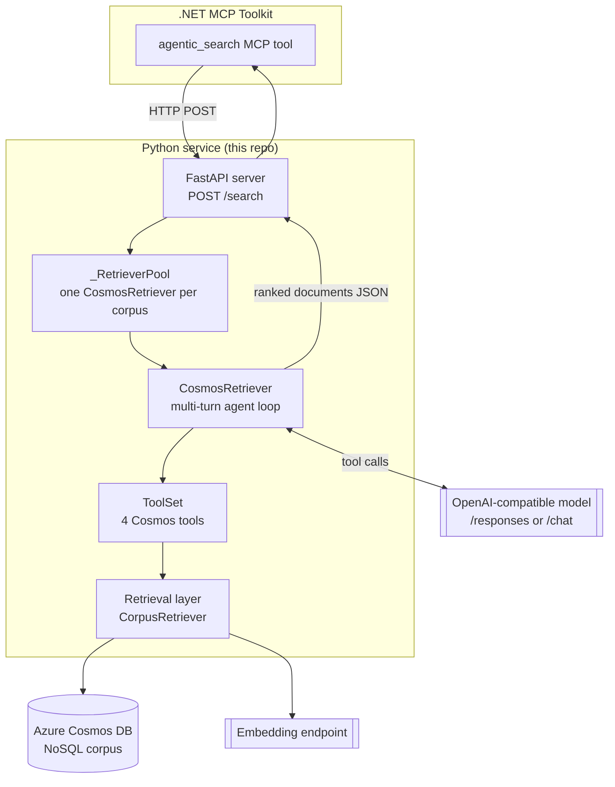

# The Agentic Search Workflow

This document explains the **end-to-end agentic retrieval workflow**: how a
natural-language question becomes a curated, ranked set of documents. It covers
the network entry point, the multi-turn search agent, the four tools it drives,
the inference backends, budgets/pruning, and how everything is configured.

Where [RETRIEVAL_SYSTEM.md](RETRIEVAL_SYSTEM.md) describes the *plumbing* (how a
single query becomes safe Cosmos SQL), this document describes the *brain* (how an
LLM agent plans, issues many searches, prunes, and decides when it's done).

---

## 1. The big picture



1. The .NET toolkit's **`agentic_search`** tool makes an HTTP `POST /search` to a
   long-lived instance of the Python FastAPI service (keeping the Cosmos SDK,
   embedding client, and tokenizer warm across calls).
2. The server routes to a per-corpus **`CosmosRetriever`**, which runs a
   **multi-turn agent loop** against an OpenAI-compatible model.
3. The model drives four **Cosmos tools** (search / grep / read / prune), each of
   which delegates to the schema-decoupled retrieval layer.
4. When the model is satisfied it emits ranked `<Document id=…>` blocks, which are
   parsed into the JSON response.

---

## 2. The network entry point (`server.py`)

A FastAPI app exposes two routes:

- **`GET /health`** → `{"status": "ok"}` (liveness; never touches Cosmos or the model).
- **`POST /search`** → runs the agent and returns curated documents.

Request body (`SearchRequest`): `query`, `maxDocuments` (1–30), optional
`database` / `container` overrides.

**`_RetrieverPool`** lazily builds and caches **one `CosmosRetriever` per corpus**
(keyed by `(database, container)`), so a single process serves many corpora while
keeping heavy clients warm. Because each retriever holds *synchronous* Cosmos/HTTP
clients and per-call agent state that are **not** thread-safe:

- Every request runs the (sync) search on a worker thread via
  `anyio.to_thread.run_sync`.
- Same-corpus requests are **serialised with a per-corpus `asyncio.Lock`**;
  different corpora run concurrently.

---

## 3. The agent (`CosmosRetriever`, `retriever.py`)

Constructed once per corpus. On init it:

1. Resolves the **`CorpusConfig`** for the target container (via
   `RetrieverSettings.resolve_corpus`, which consults `corpus_registry.json`).
2. Builds the **Cosmos** database client and the **embedding** client.
3. Builds the **`ToolSet`** (the four tools) wired to a `CorpusRetriever`.
4. Builds the **inference client** (chat or responses) and an optional **reranker**.
5. Loads a **tiktoken** encoder for token accounting/budgets.

Its public method is **`search(query, *, max_documents, max_turns,
threshold_budget, token_budget)`**, returning a **`RetrievalResult`**:

```python
RetrievalResult(
    query, documents=[RetrievedDocument(id, text, justification, rank)],
    num_turns, final_text, pool_doc_ids, elapsed_s, usage, trajectory, metadata,
)
```

`search()` dispatches to one of two backends based on `INFERENCE_BACKEND`.

---

## 4. Inference backends (`inference/openai_chat.py`)

Both backends drive the **same four Cosmos tools** via function-calling; they
differ only in the API surface:

| Backend | Function | API | Use for |
|---|---|---|---|
| `openai_responses` | `run_responses_search` | `/responses` | Reasoning models (gpt-5.x) — exposes turn-level trajectory + reasoning tokens. |
| `openai_chat` | `run_chat_search` | `/chat/completions` | Generic OpenAI-compatible chat models. |

Each backend runs the **agent loop** (up to `max_turns`, default 20):

```mermaid
sequenceDiagram
    participant M as Model
    participant A as Agent loop
    participant TS as ToolSet
    participant DB as Cosmos

    A->>M: system prompt + query + tool schemas
    loop until final answer or max_turns
        M-->>A: tool call(s) (search / grep / read / prune)
        A->>TS: execute tool(s) (in parallel where possible)
        TS->>DB: compiled Cosmos SQL
        DB-->>TS: rows
        TS-->>A: formatted observations (with token counts)
        A->>A: accumulate usage; enforce token budget
        A-->>M: tool observations (+ over-budget nudge if needed)
    end
    M-->>A: final <Document id=…> blocks
    A->>A: parse documents, attach cached text, rank
```

Responsibilities inside the loop:
- **Tool-argument parsing** (`_parse_tool_arguments`) tolerantly decodes model JSON.
- **Usage accounting** (`_acc_chat_usage` / `_acc_responses_usage`) tracks
  input/output/reasoning tokens across turns.
- **Document text caching** (`_collect_doc_text`) remembers the text of every chunk
  the agent saw, so the final answer's document ids can be rehydrated with content.
- **Document extraction** (`_extract_documents`) parses the final `<Document
  id=…><Justification>…</Justification></Document>` blocks into ranked results.

---

## 5. The system prompt (`prompts.py`)

`get_retrieval_subagent_prompt(query, num_output_docs)` frames the model as a
**retrieval subagent** (it finds documents, it does *not* answer the question).
It instructs the model to:

- decompose the query into distinct information needs,
- plan several **non-overlapping** search strategies and issue them **in parallel**,
- after each round, reflect: *what do I know / what to search next / what to prune /
  do I have enough?*,
- prune proactively as the token budget approaches its limit,
- output only the ranked `<Document id=…>` blocks (most to least relevant).

When the soft token budget is crossed,
`get_retrieval_subagent_budget_exhausted_message()` is injected as a user turn,
forcing a decision: **prune chunks and continue**, or **conclude**.

---

## 6. The four tools (`tools.py`)

The agent is given exactly four tools. Each builds a *logical* request and
delegates to the retrieval layer — **no SQL or physical field names** live here.

| Tool | Schema name | What it does |
|---|---|---|
| `SearchCorpusTool` | `search_corpus` | Hybrid/vector/full-text search; optional rerank; returns the relevant section of each hit. |
| `GrepCorpusTool` | `grep_corpus` | Fetches a full-text candidate pool, then applies a client-side **regex** filter. |
| `ReadDocumentTool` | `read_document` | Reconstructs a full document from its chunks via the configured resolver. |
| `PruneChunksTool` | `prune_chunks` | Records chunk ids whose content should be dropped from context to reclaim tokens. |

Supporting types: `ToolSchema` (provider-agnostic → OpenAI / Harmony formats),
`ToolSet` (named collection + `build()` factory), `MultiToolUseTool` (wraps a
parallel tool-call bundle), and `ToolCallMetadata` (per-call telemetry such as
returned chunk ids).

**`ToolSet.build()`** is the wiring point: pass either a pre-built `retriever`
(custom schema) *or* the `cosmos_database` + `container` + `openai_client` trio,
in which case the **default chunked-corpus retriever** is constructed
automatically. It also injects the schema's `agent_field_summary()` into the
search/grep tool descriptions so the model knows which fields it can target.

---

## 7. Budgets, turns, and pruning

The loop is bounded on three axes so it terminates and stays within context:

- **`max_turns`** — hard cap on model round-trips (`CHAT_MAX_TURNS`, default 20).
- **`threshold_budget`** (soft) — when accumulated tokens cross it, the over-budget
  message is injected, steering the model to prune or conclude.
- **`token_budget`** (hard) — the ceiling the agent must stay under.

`PruneChunksTool` + the token counter (tiktoken) let the agent trade already-seen,
low-value chunks for fresh searches without blowing the context window.

---

## 8. Reranking (optional, `rerank.py`)

If configured, a `Reranker` re-scores `search_corpus` / `read_document` results
before they're shown to the model:

- **`BasetenReranker`** — a hosted reranker endpoint (if `BASETEN_*` set), else
- **`VLLMReranker`** — a local vLLM reranker (if `VLLM_RERANKER_URL` set), else
- **None** — results are returned in the retrieval layer's native order.

---

## 9. Configuration (`config.py`)

`RetrieverSettings` (pydantic-settings; env vars + `.env`) is the single source of
truth. Highlights:

- **Corpus targeting** — `ACCOUNT_URI`, `COSMOS_DATABASE`,
  `COSMOS_CORPUS_CONTAINER`, plus a `corpus_registry.json` that maps a container
  name to its account/database/embedding endpoint/model. `resolve_corpus()`
  returns a fully-resolved `CorpusConfig`.
- **Inference** — `INFERENCE_BACKEND` (`openai_responses` | `openai_chat`),
  `CHAT_BASE_URL`, `CHAT_MODEL`, `CHAT_MAX_TURNS`, `CHAT_REASONING_EFFORT`, etc.
- **Embeddings** — per-corpus base URL / model / query instruction.
- **Auth** — Cosmos uses `AzureCliCredential` by default (opt into the broader
  `DefaultAzureCredential` chain with `COSMOS_USE_DEFAULT_CREDENTIAL=1`); secrets
  are read from env, never written to files.

---

## 10. The response

`POST /search` returns the agent's curated set:

```json
{
  "query": "…",
  "num_turns": 6,
  "elapsed_s": 38.2,
  "documents": [
    {"id": "doc_123", "text": "…", "justification": "why relevant", "rank": 0}
  ]
}
```

For the `/responses` backend, a per-query **trajectory** (the search queries
issued, per-turn tool calls, and the final document set) is also captured on the
`RetrievalResult`, which is invaluable for debugging and evaluation.

---

## 11. Concurrency & safety summary

| Concern | Mechanism |
|---|---|
| Warm clients across requests | `_RetrieverPool` caches one retriever per corpus |
| Sync clients on an async server | `anyio.to_thread.run_sync` |
| Same-corpus thread-safety | per-corpus `asyncio.Lock` |
| Cosmos overload / throttling | executor `BoundedSemaphore` + tenacity retries |
| Runaway agents | `max_turns` + token budgets + pruning |
| Query injection | bound `@params` + `CosmosPath` validation (retrieval layer) |

---

## 12. File map

| File | Role |
|---|---|
| `server.py` | FastAPI service, `/health`, `/search`, `_RetrieverPool` |
| `retriever.py` | `CosmosRetriever` agent façade + `RetrievalResult` |
| `inference/openai_chat.py` | `run_chat_search` / `run_responses_search` agent loops |
| `prompts.py` | System prompt + budget-exhausted message |
| `tools.py` | The four tools, `ToolSchema`, `ToolSet` |
| `rerank.py` | Optional Baseten / vLLM rerankers |
| `config.py` | `RetrieverSettings`, `CorpusConfig`, corpus registry |
| `cosmos_retriever/retrieval/` | The schema-decoupled retrieval layer (see [RETRIEVAL_SYSTEM.md](RETRIEVAL_SYSTEM.md)) |
