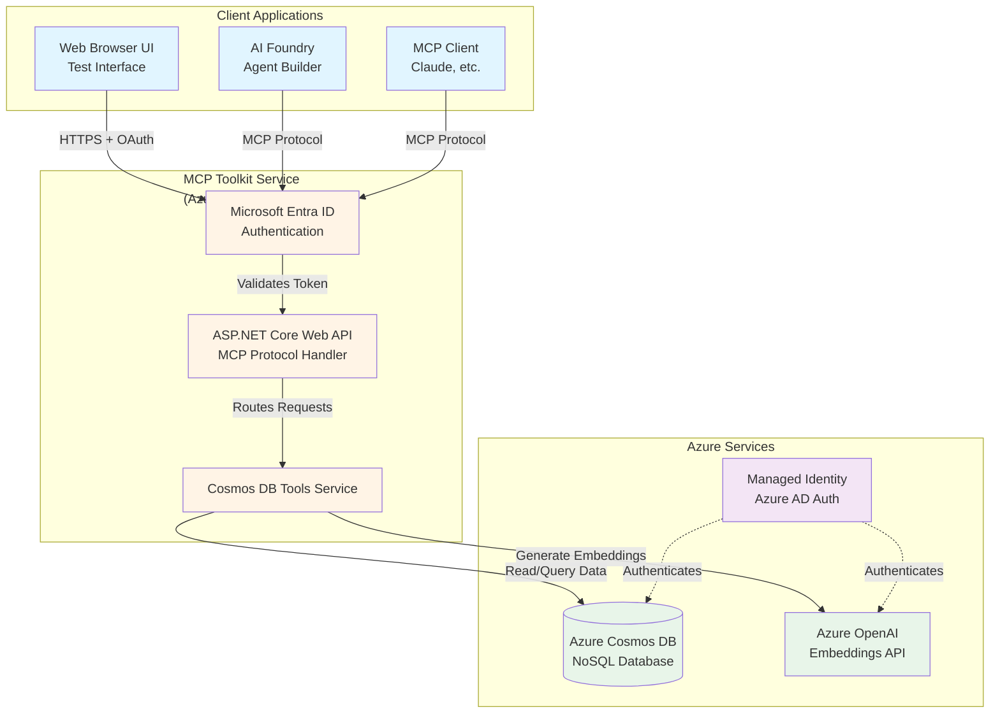
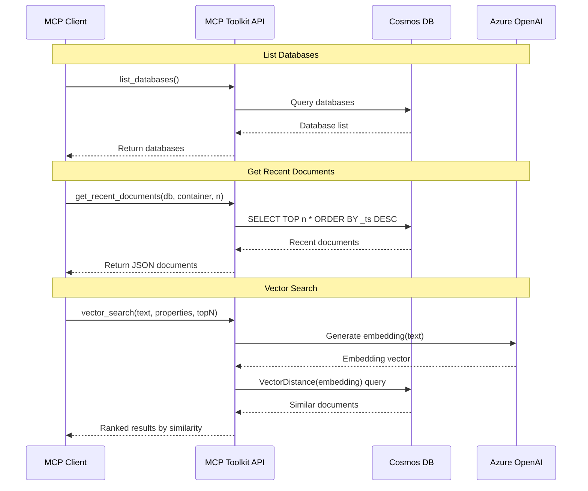
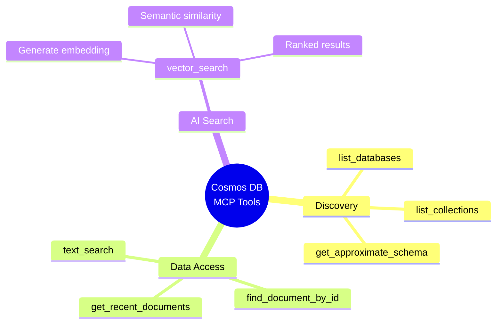
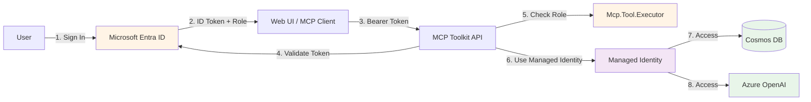
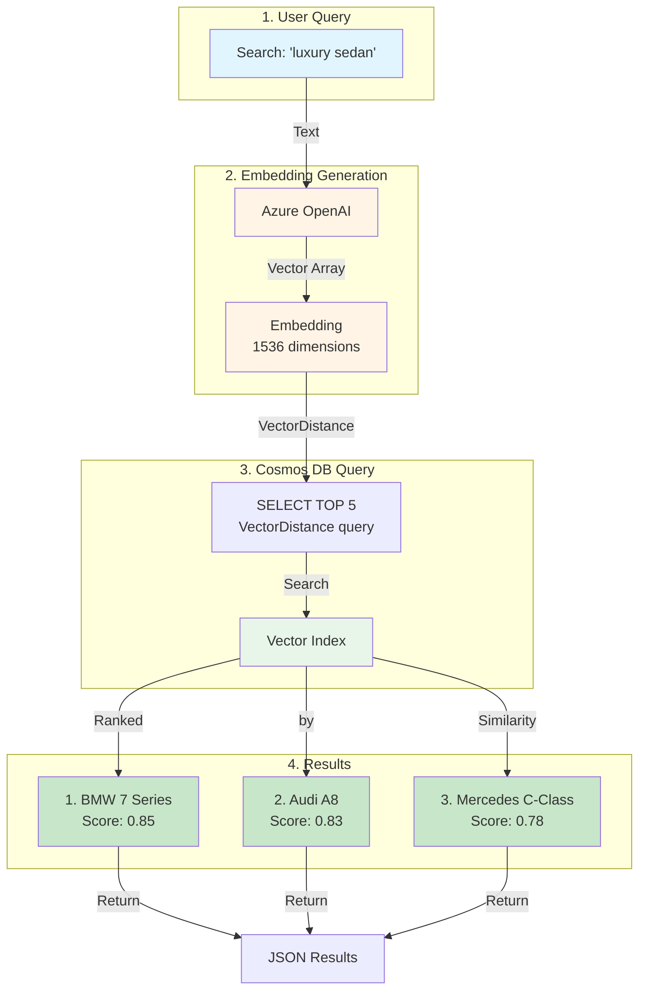
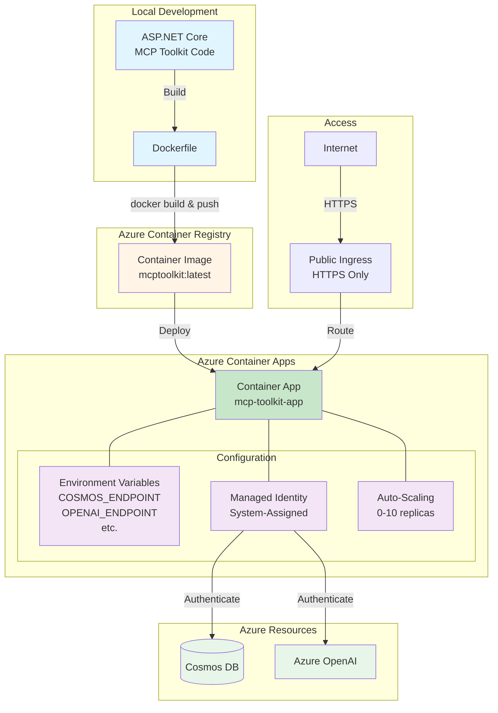

# Azure Cosmos DB MCP Toolkit - Architecture Diagram

## Simple Architecture Overview

## Tool Operations Flow

## Available MCP Tools

## Security & Authentication

## Data Flow for Vector Search Demo

## Deployment to Azure Container Apps

---

## How to Use These Diagrams

### Option 1: Render in VS Code
1. Install the "Markdown Preview Mermaid Support" extension
2. Open this file and preview it (Ctrl+Shift+V)
3. Take screenshots of the rendered diagrams

### Option 2: Use Mermaid Live Editor
1. Go to https://mermaid.live
2. Copy/paste each diagram code block
3. Export as PNG or SVG

### Option 3: Use in PowerPoint/Slides
1. Copy the diagram code
2. Use Mermaid tools or render online
3. Export and insert as images

### Option 4: GitHub/Markdown
These diagrams render automatically in:
- GitHub README.md files
- Azure DevOps wikis
- Many documentation platforms

---

## Presentation Talking Points

### Slide 1: Architecture Overview
- **3-tier architecture**: Client → MCP Service → Azure Resources
- **Enterprise security**: Microsoft Entra ID + Managed Identity
- **Scalable deployment**: Azure Container Apps with auto-scaling

### Slide 2: Tool Operations
- **7 MCP tools** for Cosmos DB operations
- **Standard MCP protocol** - works with any MCP client
- **Real-time operations** - direct API calls, no caching

### Slide 3: Vector Search Flow
- **Natural language queries** → Semantic search
- **Azure OpenAI integration** for embeddings
- **Native Cosmos DB vector search** - no external vector DB needed

### Slide 4: Security Model
- **Zero keys in code** - all authentication via Azure AD
- **Role-based access** - granular permissions
- **Managed Identity** - secure service-to-service auth

### Slide 5: Container Apps Deployment
- **Simple containerization** - Standard Dockerfile, any language
- **Azure Container Registry** - Secure image storage
- **Auto-scaling** - Scale to zero, scale to demand
- **Managed Identity** - No connection strings needed
- **One-command deployment** - PowerShell script automates everything
